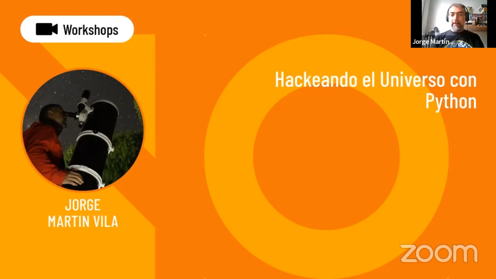
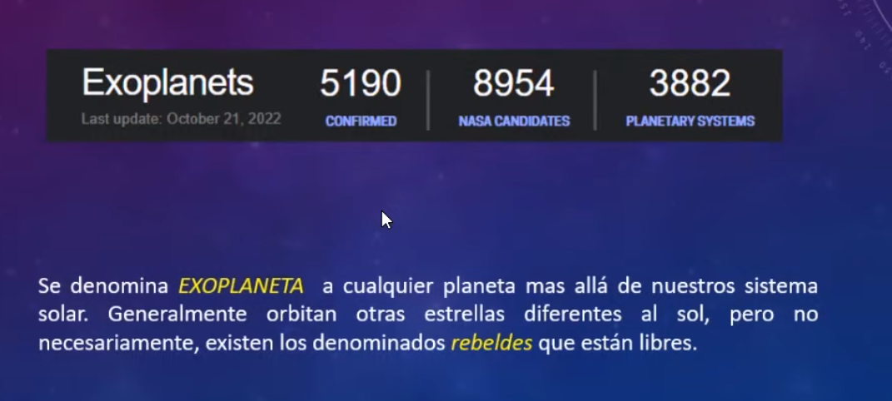
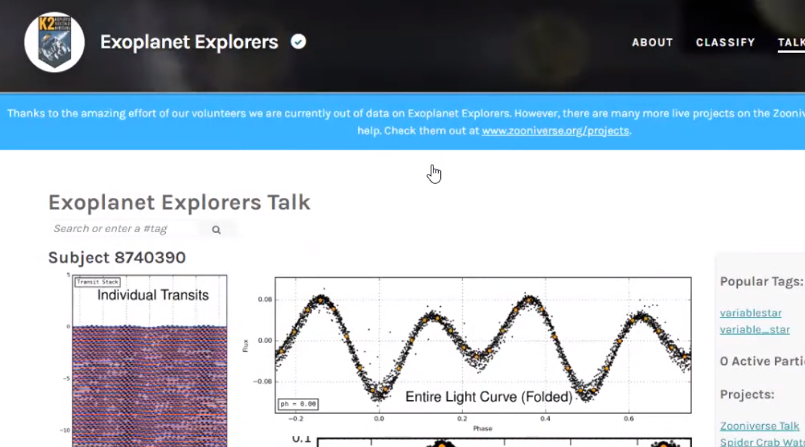
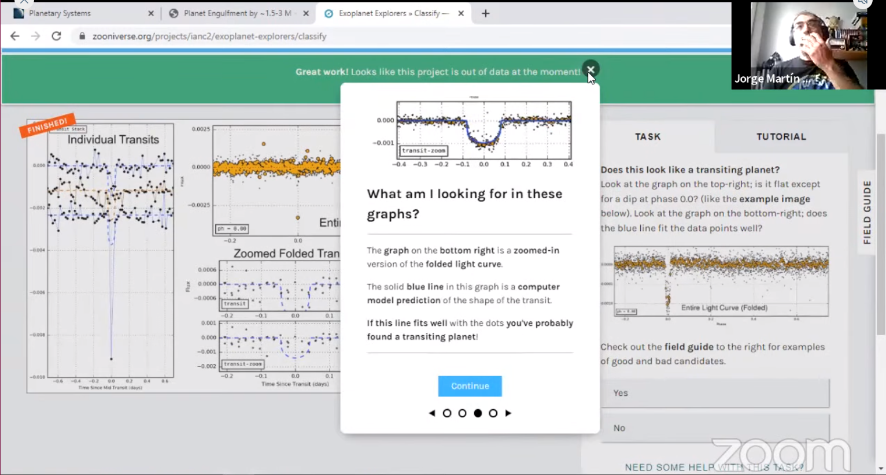
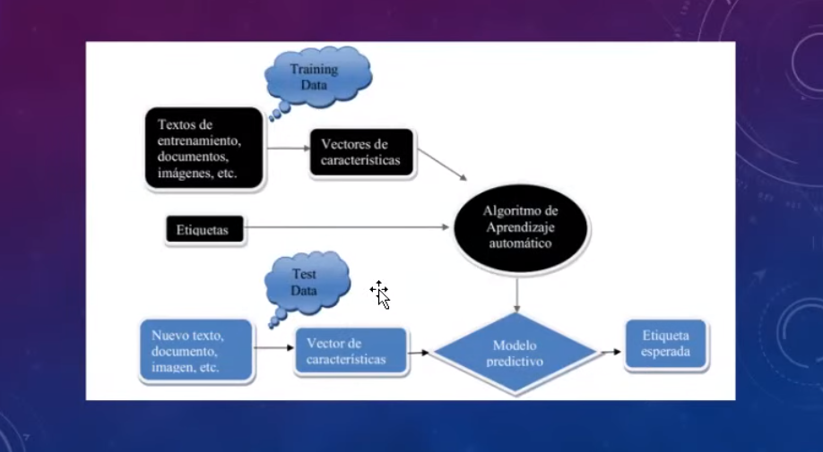
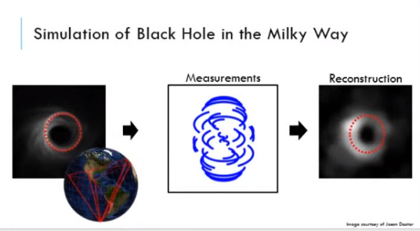

## Hackeando el universo con python [workshop nerdearla]



Dictado por Jorge Martin

```
El Universo frío y oscuro, lejano nos hace imaginar que alguien nos observa, pero qué certeza tenemos de que hay vida en otro planeta?. Y si te contara que lo podes hacer desde la comodidad de tu casa y aportar tu granito de arena al descubrimiento espacial ayudando a los científicos?, no solo eso te desafío a que te creas que sos un científico o científica en la era espacial, porque de eso se trata de que todo lo que podamos hacer desde una pc, notebook, netbook, tablet, celular te puede convertir en un Científic@ Ciudadan@. Para eso no te voy a explicar como Python entre otras herramientas nos puedo ayudar a transitar ese camino. Aprenderemos sobre telescopios, galaxias, exoplanetas y a buscar vida fuera de la tierra. Entenderemos como se construyo la primer imagen de un agujero negro y detectaremos el transito de un exoplaneta. Pero si crees que todo esto es algo lejano, te propongo que veas la posibilidad de defender la tierra de un impacto de asteroide simulando los mismos cálculos que desarrollar La Nasa para el Programa de Defensa Planetaria.
```

[Ver completo en Youtube](https://youtu.be/KQ4w6TotXLY)

---

Hacemos una introducción a la ciencia ciudadana. Algunos métodos de procesamiento de datos para predecir fenómenos naturales.

En el ejemplo del workshop se trabaja con pandas, tomando información de archivos .csv

> Jorge aclara sobre instalar pandas via pip y luego importarlo desde el IDE. Revisar el video completo para más info.

```py 
import pandas as pd
```

### Primera parte: Lluvia de meteoros

Comenta sobre meteoros, primeros descubrimientos y una reseña histórica.



### Segunda parte: Exoplanetas

Luego de mostrar ejemplos hace una introducción a los exolplanetas (cualquier planeta fuera de nuestra galaxia), demuestra cómo obtener información y datos reales de NASA.







### Ejemplo Agujero negro y ciencia ciudadana

Muchos de los conocimientos que se utilizaron para la reconstrucción del agujero negro tuvieron su origen en la divulgación de ciencia ciudadana a partir de la apertura de muchos recursos en tiempos de pandemia.

